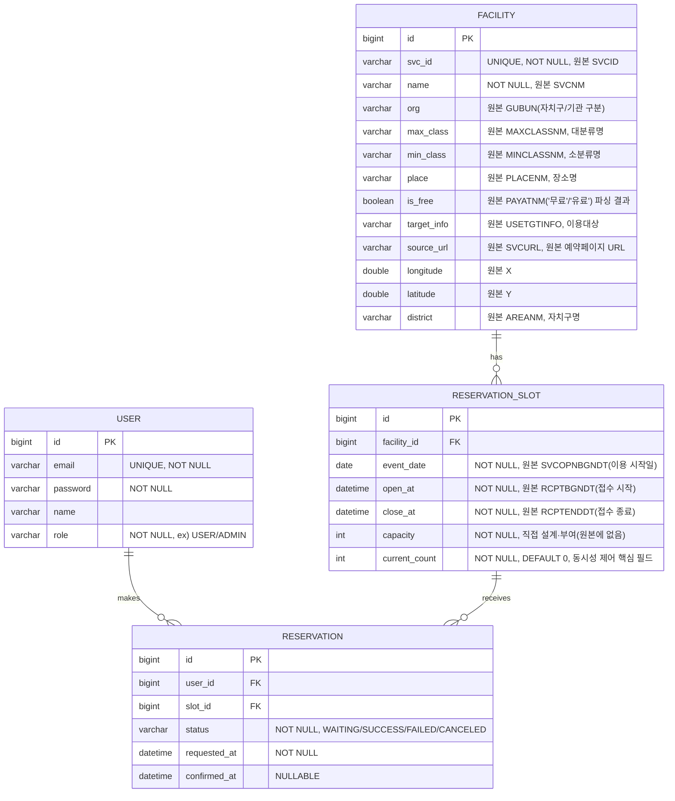

# GongGong (공공 문화행사 예약 서비스)

서울시 공공서비스예약(문화행사) 데이터를 기반으로 한 **선착순 예약 시스템**입니다. 개인 프로젝트로 한 학기(1학기) 동안 진행하며, 핵심 목표는 실제 공공데이터에서 관찰되는 **인기 프로그램의 조기 마감 현상**을 재현하고, 이를 **캐싱(Redis)** 과 **분산락(Redisson)** 으로 해결하는 과정을 직접 구현/검증하는 것입니다.

> 본 문서는 구현 전 설계를 정리한 문서입니다. 각 결정에는 "왜 그렇게 설계했는지" 근거를 함께 남겨, 추후 발표자료 작성 시 그대로 참고할 수 있도록 작성했습니다.

---

## 목차

1. [프로젝트 소개 및 문제 정의](#1-프로젝트-소개-및-문제-정의)
2. [기술 스택](#2-기술-스택)
3. [디렉토리/패키지 구조](#3-디렉토리패키지-구조)
4. [ERD 설계](#4-erd-설계)
5. [API 명세](#5-api-명세)
6. [공공데이터 동기화 설계](#6-공공데이터-동기화-설계)
7. [동시성 제어 구현 계획](#7-동시성-제어-구현-계획)
8. [캐싱 전략](#8-캐싱-전략)
9. [CORS 설정 안내](#9-cors-설정-안내)
10. [로컬 개발 환경 세팅 가이드](#10-로컬-개발-환경-세팅-가이드)
11. [구현 예정 (확장 예정 기능)](#11-구현-예정-확장-예정-기능)

---

## 1. 프로젝트 소개 및 문제 정의

### 왜 이 프로젝트인가

서울 열린데이터광장이 공개하는 **문화행사 공공서비스예약 API**의 실제 응답을 확인해보면, 흥미로운 현상이 관찰됩니다.

> 접수기간(`RCPTBGNDT`~`RCPTENDDT`)이 아직 끝나지 않았는데도, 서비스 상태(`SVCSTATNM`)가 이미 **"예약마감"** 으로 표시되는 프로그램이 다수 존재합니다.

이는 원본 공공 예약 시스템에서 실제로 **인기 프로그램의 조기 마감** 이 발생하고 있다는 근거입니다. 즉, 공식 접수 마감일과 무관하게 신청이 몰리는 시점에 이미 정원이 다 찬다는 뜻이며, 이는 일반적인 "선착순 티켓팅" 서비스에서 발생하는 것과 동일한 유형의 문제입니다.

- **정합성 문제**: 다만 원본 API에는 모집 정원(capacity) 필드 자체가 없어, 우리가 직접 확인할 수 있는 것은 "마감되었다는 결과"뿐입니다. 이 프로젝트는 정원 개념을 직접 부여하고, 동시 요청이 몰리는 상황을 우리가 통제된 환경에서 재현하여, 정원을 초과하지 않고 정확히 마감시킬 수 있는지를 검증합니다.
- **성능 문제**: 마감 여부를 확인하려는 조회 요청 역시 인기 프로그램일수록 몰릴 것이므로, 조회 API의 응답 속도 저하도 함께 재현하고 캐싱으로 완화합니다.

이 프로젝트는 다음 세 가지를 직접 구현하며 검증하는 것을 목표로 합니다.

1. 원본 데이터에는 없는 `capacity`(모집 정원)를 우리가 규칙에 따라 부여하고, 동시 요청 상황에서도 `current_count`가 `capacity`를 절대 초과하지 않는 정합성 보장
2. 조회가 잦은 API에 캐싱을 적용해 DB 부하와 응답 시간을 개선
3. "비관적 락"과 "Redisson 분산락" 두 가지 동시성 제어 방식을 트래픽 테스트로 정량 비교하여, 각 방식의 장단점을 근거를 가지고 설명할 수 있도록 함

### 프로젝트 범위

- 백엔드(API 서버)만 구현하며, 프론트엔드는 별도 저장소에서 개발됨을 전제로 함
- 데이터 원본은 서울 열린데이터광장의 자치구별 문화행사 공공서비스예약 API를 관리자 동기화(배치) 방식으로 호출하여 내부 DB에 적재 ([6. 공공데이터 동기화 설계](#6-공공데이터-동기화-설계) 참고)

---

## 2. 기술 스택

| 구분 | 기술 | 비고 |
|---|---|---|
| Language | Java 17+ | Record, Sealed Class 등 최신 문법 활용 가능 |
| Framework | Spring Boot 3.x | |
| Data Access | Spring Data JPA | 비관적 락(1단계) 구현에 `@Lock` 활용 |
| Security | Spring Security + JWT | Stateless 인증, 프론트/백 분리 구조에 적합 |
| Database | MySQL (또는 PostgreSQL) | `SELECT ... FOR UPDATE` 비관적 락 지원 |
| Cache / Lock | Redis, Redisson | 캐싱(Look-aside) 및 분산락(2단계) 구현 |
| 외부 연동 | 서울 열린데이터광장 문화행사 공공서비스예약 API (XML) | 자치구별로 별도 API가 제공됨, [6번](#6-공공데이터-동기화-설계) 참고 |
| Build Tool | Gradle | |
| 부하 테스트 | nGrinder / K6 등 | 1단계 vs 2단계 성능·정합성 비교용, [7-3. 부하 테스트 계획](#7-3-부하-테스트-계획) 참고 |

### 필요 의존성 (build.gradle)

위 스택을 기준으로 `build.gradle`에 추가해야 하는 의존성입니다. 관심사별로 그룹핑했습니다.

```groovy
dependencies {
    // Web / 기본
    implementation 'org.springframework.boot:spring-boot-starter-web'
    implementation 'org.springframework.boot:spring-boot-starter-validation'

    // JPA + DB
    implementation 'org.springframework.boot:spring-boot-starter-data-jpa'
    runtimeOnly 'com.mysql:mysql-connector-j'
    // PostgreSQL을 쓸 경우: runtimeOnly 'org.postgresql:postgresql'

    // Security + JWT
    implementation 'org.springframework.boot:spring-boot-starter-security'
    implementation 'io.jsonwebtoken:jjwt-api:0.12.6'
    runtimeOnly 'io.jsonwebtoken:jjwt-impl:0.12.6'
    runtimeOnly 'io.jsonwebtoken:jjwt-jackson:0.12.6'

    // Redis + Redisson (캐싱 + 분산락, 7단계 참고)
    implementation 'org.springframework.boot:spring-boot-starter-data-redis'
    implementation 'org.redisson:redisson-spring-boot-starter:3.37.0'

    // 공공데이터 XML 파싱 (6번 동기화 설계에서 사용)
    implementation 'com.fasterxml.jackson.dataformat:jackson-dataformat-xml'

    // 보일러플레이트 축소 (선택)
    compileOnly 'org.projectlombok:lombok'
    annotationProcessor 'org.projectlombok:lombok'

    // 테스트
    testImplementation 'org.springframework.boot:spring-boot-starter-test'
    testImplementation 'org.springframework.security:spring-security-test'
}
```

**참고**
- `jjwt`, `redisson-spring-boot-starter` 버전은 사용하는 Spring Boot 버전과의 호환 여부를 먼저 확인하고 최신 안정 버전으로 맞춥니다.
- API 문서화가 필요하면 `org.springdoc:springdoc-openapi-starter-webmvc-ui`를 추가로 검토합니다(현재 스택에는 필수 항목으로 넣지 않음).
- 외부 API(서울 열린데이터광장) 호출은 Spring Web에 포함된 `RestClient`/`RestTemplate`으로 처리하므로 별도 HTTP 클라이언트 의존성은 불필요합니다.

---

## 3. 디렉토리/패키지 구조

도메인 중심(Domain-oriented) 패키지 구조를 채택합니다. 계층형(controller/service/repository를 최상위로 나누는 구조) 대신 도메인별로 나누는 이유는, 이 프로젝트의 핵심 로직(공공데이터 동기화, 동시성 제어, 캐싱)이 `facility`, `reservation` 도메인에 집중되어 있어 관련 코드를 한 곳에서 관리하는 것이 정책을 일관되게 적용하고 추적하기 쉽기 때문입니다.

```
com.gonggong
├── common
│   ├── config          # SecurityConfig, RedisConfig, RedissonConfig, CorsConfig, SwaggerConfig 등
│   ├── exception        # 전역 예외 처리(@RestControllerAdvice), 커스텀 예외
│   ├── response         # 공통 API 응답 포맷(ApiResponse<T> 등)
│   └── lock              # 분산락 공용 어노테이션(@DistributedLock) + AOP (2단계에서 도입)
│
├── facility
│   ├── controller        # FacilityController
│   ├── service            # FacilityService(목록/필터 조회)
│   ├── sync                # 공공데이터 동기화 전담 하위 패키지 (아래 참고)
│   │   ├── client           # SeoulCultureReservationApiClient (자치구별 XML 호출)
│   │   ├── dto                # 원본 XML 매핑용 DTO (SVCID, SVCSTATNM 등 원본 필드명 유지)
│   │   ├── parser            # XmlToFacilityMapper (원본 DTO → Facility/ReservationSlot 변환)
│   │   ├── policy             # CapacityAssignmentPolicy (카테고리별 기본 정원 규칙)
│   │   └── FacilitySyncService.java  # upsert 오케스트레이션
│   ├── repository         # FacilityRepository
│   ├── domain              # Facility 엔티티
│   └── dto                  # FacilityResponse 등 (API 응답용, sync/dto와는 별도)
│
├── reservation
│   ├── controller        # ReservationController, ReservationSlotController
│   ├── service             # ReservationService(동시성 제어 핵심), ReservationSlotService
│   ├── repository         # ReservationRepository, ReservationSlotRepository
│   ├── domain               # ReservationSlot, Reservation 엔티티, ReservationStatus(Enum)
│   └── dto                   # ReservationRequest/Response 등
│
├── user
│   ├── controller
│   ├── service               # UserService, AuthService(JWT 발급/검증)
│   ├── repository
│   ├── domain                 # User 엔티티, Role(Enum)
│   └── dto
│
└── GonggongApplication.java
```

**설계 원칙**
- `facility.sync`를 별도 하위 패키지로 분리한 이유: 공공데이터 연동(HTTP 호출, XML 파싱, 정원 부여 규칙)은 도메인 로직과 관심사가 분명히 다르고, 원본 API 스펙 변경 시 영향 범위를 `sync` 패키지 안으로 한정하기 위함입니다. `sync.dto`는 원본 필드명(`SVCID`, `SVCSTATNM` 등)을 그대로 유지해 매핑 실수를 줄이고, 이후 `parser`에서만 우리 도메인 모델(camelCase, 의미 있는 이름)로 변환합니다.
- 각 도메인 패키지는 `controller → service → repository` 방향으로만 의존하며, 도메인 간 참조는 서비스 계층에서만 허용합니다.
- `common.lock`을 별도 패키지로 분리한 이유: 1단계(비관적 락)에서는 필요 없지만, 2단계에서 Redisson 분산락을 AOP 어노테이션(`@DistributedLock`)으로 공통화할 때 재사용할 수 있도록 미리 자리를 마련해 둠

---

## 4. ERD 설계

원본 API 필드를 그대로 저장하지 않고, 우리 서비스에서 필요한 형태로 재구성합니다. 각 컬럼 옆에 대응되는 원본 필드를 주석으로 남겨 추후 동기화 로직 디버깅 시 추적하기 쉽게 합니다.



**설계 근거**

- `Facility.svc_id`(원본 `SVCID`)를 UNIQUE로 두어 [6. 공공데이터 동기화 설계](#6-공공데이터-동기화-설계)에서 upsert 기준 키로 사용합니다. 자치구별로 API가 나뉘어 있어도 `SVCID`는 원본 시스템 전체에서 고유하다고 가정합니다.
- `ReservationSlot.capacity`는 원본 API에 존재하지 않는, **이 프로젝트가 직접 설계해서 부여하는 값**임을 명시적으로 컬럼 주석에 남겼습니다. 부여 규칙은 [6번](#6-공공데이터-동기화-설계)에서 다룹니다.
- `ReservationSlot`을 `Facility`와 별도 테이블로 분리한 이유: 같은 프로그램(`Facility`)이 여러 회차(`event_date`)로 운영될 수 있기 때문입니다. 동기화 시 같은 `svc_id`라도 회차별 접수기간이 다르면 별도의 `ReservationSlot` row로 upsert합니다(`facility_id` + `open_at` + `close_at` 조합으로 식별).
- `ReservationSlot.current_count`는 이 프로젝트에서 가장 중요한 필드입니다. `POST /api/reservations` 요청이 동시에 여러 건 들어와도 `current_count`가 `capacity`를 초과해 갱신되면 안 되며, 이 값을 안전하게 증가시키는 것이 [7. 동시성 제어 구현 계획](#7-동시성-제어-구현-계획)의 핵심 목표입니다. 이 필드가 정확히 관리되어야, 원본 서비스에서 관찰된 "접수기간 중 조기 마감"을 우리 시스템에서도 **오차 없이(정원 초과 없이)** 재현할 수 있습니다.
- `Reservation.status`를 `WAITING/SUCCESS/FAILED/CANCELED`로 세분화한 이유: 락 획득 대기 중(WAITING), 락 획득 후 정원 초과로 실패(FAILED), 사용자가 취소한 경우(CANCELED)를 구분해서 기록해야 이후 트래픽 테스트에서 "몇 건이 실패했는지, 왜 실패했는지"를 분석할 수 있기 때문입니다.

---

## 5. API 명세

공통 응답 포맷:

```json
{
  "success": true,
  "data": { },
  "error": null
}
```

에러 발생 시:

```json
{
  "success": false,
  "data": null,
  "error": { "code": "SLOT_FULL", "message": "모집 정원이 마감되었습니다." }
}
```

| Method | Endpoint | 설명 |
|---|---|---|
| GET | `/api/facilities` | 문화행사 목록 조회 (자치구/분류 필터, 캐싱 대상) |
| GET | `/api/slots/{id}` | 예약 슬롯 상세 조회 (잔여 정원 포함) |
| POST | `/api/reservations` | 예약 신청 (동시성 제어 핵심 엔드포인트) |
| GET | `/api/reservations/{id}` | 예약 상세/상태 조회 |
| POST | `/api/admin/sync` | 서울 열린데이터광장 문화행사 데이터 동기화 (관리자 전용) |

### GET /api/facilities

- 설명: 등록된 문화행사 목록을 조회합니다. `district`(자치구), `maxClass`/`minClass`(분류) 쿼리 파라미터로 필터링할 수 있습니다. 원본 데이터는 관리자 동기화를 통해서만 갱신되므로 변경 빈도가 낮아 캐싱 대상입니다.

Query 예시: `GET /api/facilities?district=강남구&minClass=전시%2F관람`

Response 예시:
```json
{
  "success": true,
  "data": [
    {
      "id": 1,
      "svcId": "20250012345",
      "name": "OO미술관 특별전시",
      "org": "강남구",
      "maxClass": "문화체험",
      "minClass": "전시/관람",
      "place": "OO미술관",
      "isFree": false,
      "targetInfo": "누구나",
      "sourceUrl": "https://yeyak.seoul.go.kr/...",
      "district": "강남구"
    }
  ],
  "error": null
}
```

### GET /api/slots/{id}

- 설명: 특정 예약 슬롯(회차)의 상세 정보(이용일, 접수 기간, 정원, 잔여 인원)를 조회합니다.

Response 예시:
```json
{
  "success": true,
  "data": {
    "id": 10,
    "facilityId": 1,
    "eventDate": "2026-04-01",
    "openAt": "2026-03-02T10:00:00",
    "closeAt": "2026-03-20T18:00:00",
    "capacity": 30,
    "currentCount": 27
  },
  "error": null
}
```

### POST /api/reservations

- 설명: 로그인한 사용자가 특정 슬롯에 예약을 신청합니다. 정원이 남아있는 경우에만 `SUCCESS`로 확정되며, 이 과정에서 동시성 제어가 적용됩니다.

Request 예시:
```json
{
  "slotId": 10
}
```

Response 예시 (성공):
```json
{
  "success": true,
  "data": {
    "reservationId": 501,
    "status": "SUCCESS"
  },
  "error": null
}
```

Response 예시 (정원 마감):
```json
{
  "success": false,
  "data": null,
  "error": { "code": "SLOT_FULL", "message": "모집 정원이 마감되었습니다." }
}
```

### GET /api/reservations/{id}

- 설명: 예약 건의 현재 상태(WAITING/SUCCESS/FAILED/CANCELED)와 상세 정보를 조회합니다.

Response 예시:
```json
{
  "success": true,
  "data": {
    "reservationId": 501,
    "slotId": 10,
    "status": "SUCCESS",
    "requestedAt": "2026-03-02T10:00:01.234",
    "confirmedAt": "2026-03-02T10:00:01.456"
  },
  "error": null
}
```

### POST /api/admin/sync

- 설명: 서울 열린데이터광장 문화행사 공공서비스예약 API를 자치구별로 호출하여 `Facility`, `ReservationSlot` 데이터를 동기화합니다. 관리자(Role=ADMIN)만 호출 가능하며, 실행 시 관련 캐시를 무효화합니다. 상세 동작은 [6번](#6-공공데이터-동기화-설계) 참고.

Request 예시(선택 파라미터, 특정 자치구만 동기화하고 싶을 때):
```json
{
  "districts": ["강남구", "종로구"]
}
```

Response 예시:
```json
{
  "success": true,
  "data": { "syncedDistricts": 2, "syncedFacilities": 42, "syncedSlots": 58 },
  "error": null
}
```

---

## 6. 공공데이터 동기화 설계

### 6-1. 자치구별 API 호출 구조

서울 열린데이터광장의 문화행사 공공서비스예약 API는 **단일 API가 아니라 자치구마다 서비스명이 다른 API 묶음**으로 제공됩니다. 예를 들어 강남구는 `GNListPublicReservationCulture`처럼 자치구 접두 코드 + 공통 접미사(`ListPublicReservationCulture`) 형태의 서비스명을 가집니다.

이 구조를 다루기 위해 다음과 같이 설계합니다.

- `SeoulOpenApiProperties`: `baseUrl`, `authKey` 등 공통 접속 정보를 보관하는 설정 클래스 (`application.yml` → 환경변수 바인딩)
- 자치구 ↔ 서비스명 매핑 테이블: `자치구명 → 서비스명`을 상수/설정(enum 또는 YAML)으로 관리합니다. 예:

  | 자치구 | 서비스명(예시) |
  |---|---|
  | 강남구 | `GNListPublicReservationCulture` |
  | 종로구 | `JRListPublicReservationCulture` |
  | ... | (25개 자치구 전체를 동일한 패턴으로 등록) |

  자치구가 25개로 유한하고 서비스명이 자주 바뀌지 않으므로, 코드 안에 하드코딩된 매핑 대신 **설정 파일(YAML) 또는 DB 테이블로 분리**하여 실제 서비스명이 변경되거나 신규 자치구가 API를 오픈했을 때 배포 없이 대응할 수 있게 합니다.
- `SeoulCultureReservationApiClient`: 자치구 하나를 입력받아 해당 서비스명으로 `http://openapi.seoul.go.kr:8088/{인증키}/xml/{서비스명}/{시작인덱스}/{종료인덱스}/` 형태의 URL을 조합해 호출합니다. 응답 건수가 요청한 페이지 크기와 같으면 다음 페이지를 이어서 호출하는 방식으로 전체 데이터를 페이지네이션합니다.
- `FacilitySyncService.syncAll()`은 25개 자치구를 순회하며 `SeoulCultureReservationApiClient`를 반복 호출합니다. 자치구 단위로 예외를 격리하여, 특정 자치구 API가 일시 장애여도 나머지 자치구 동기화는 계속 진행되도록 합니다.

### 6-2. XML 파싱 및 upsert

- 응답은 XML이므로, `RestTemplate`/`RestClient` + Jackson `XmlMapper`(또는 JAXB)로 `sync.dto`의 원본 필드명 그대로인 DTO(`GUBUN`, `SVCID`, `SVCSTATNM` ... )로 역직렬화합니다. 원본 필드명을 DTO 단계에서 그대로 유지하는 이유는, 이후 API 응답 필드가 추가/변경되었을 때 원본 문서와 1:1로 비교하며 디버깅하기 쉽게 하기 위함입니다.
- `XmlToFacilityMapper`가 원본 DTO를 우리 도메인 모델로 변환합니다.
  - `PAYATNM`("무료"/"유료" 텍스트) → `isFree`(boolean) 파싱
  - `SVCOPNBGNDT` → `ReservationSlot.eventDate`, `RCPTBGNDT`/`RCPTENDDT` → `open_at`/`close_at`
  - `X`/`Y` → `longitude`/`latitude` (문자열 → double 변환, 결측 시 null 허용)
- upsert 기준:
  - `Facility`는 `svc_id`(원본 `SVCID`) 기준으로 존재하면 갱신, 없으면 삽입
  - `ReservationSlot`은 `(facility_id, open_at, close_at)` 조합 기준으로 upsert하여, 같은 프로그램의 회차가 갱신되거나 신규 회차가 추가되는 경우를 모두 처리
- 동기화 실행 시점: 초기 개발/테스트 단계에서는 `POST /api/admin/sync`로 수동 트리거하여 **동기화 시점을 우리가 직접 통제**합니다. 이는 조기 마감 재현 실험을 할 때, 정원이 부여된 슬롯을 원하는 시점에 정확히 준비해두기 위함입니다. 스케줄러(`@Scheduled`) 자동화는 [11. 구현 예정](#11-구현-예정-확장-예정-기능)에서 다룹니다.

### 6-3. capacity(모집 정원) 부여 규칙

원본 API에는 모집 정원이 없으므로, **의도적으로 재현 가능한 규칙**을 세워 부여합니다. 목표는 "실제 정원 추정"이 아니라, 동시성 제어 실험이 재현 가능하도록 **의도적으로 작고 명확한 정원**을 부여하는 것입니다.

- 1차 기준: `min_class`(소분류) 기준 기본값 테이블을 둡니다. 예)
  - 전시/관람: 50명
  - 교육/체험, 강좌: 30명
  - 공연/행사: 100명
  - 위 표에 없는 소분류: `max_class`(대분류) 기준 보정값 사용
- 2차 기준(fallback): 위 두 기준 모두 매칭되지 않으면 전역 기본값(예: 20명)을 사용합니다.
- 이 규칙은 `CapacityAssignmentPolicy` 클래스에 격리하여, 실험 중 "정원을 더 작게 잡아 경쟁을 더 치열하게 만들고 싶다" 같은 요구가 생겼을 때 이 클래스만 수정하면 되도록 합니다.
- **설계 근거**: 원본 데이터의 실제 조기 마감 현상은 "정원을 알 수 없는 상태에서 결과만 관찰"한 것이지만, 우리는 재현 가능한 부하 테스트가 목적이므로 정원을 처음부터 작게 고정해 동시 요청 200건 vs 정원 30명처럼 **경쟁 강도를 우리가 설계**합니다. 실제 정원을 추정하려는 시도(예: 과거 마감 시점 트래픽 역산)는 범위를 벗어나므로 하지 않습니다.

---

## 7. 동시성 제어 구현 계획

동시성 제어는 이 프로젝트의 핵심 검증 대상이므로, 한 번에 최종 구현을 적용하지 않고 **1단계(비관적 락) → 2단계(Redisson 분산락)** 순서로 단계를 나누어 구현합니다. 이렇게 나누는 이유는 (1) 먼저 가장 단순한 방식으로 정합성을 보장하는 baseline을 만들고, (2) 이후 분산락으로 전환했을 때의 성능/구조적 차이를 실측 비교할 수 있도록 하기 위함입니다.

### 7-1. 비관적 락 (`SELECT ... FOR UPDATE`)

- **적용 대상**: `reservation.service.ReservationService.reserve(userId, slotId)`
  - `ReservationSlotRepository`에 `@Lock(LockModeType.PESSIMISTIC_WRITE)`를 적용한 `findByIdForUpdate(Long slotId)` 메서드를 정의하고, `reserve()` 내에서 이 메서드로 슬롯을 조회
  - 하나의 트랜잭션 안에서 "잔여 정원 확인 → `current_count` 증가 → `Reservation` 저장"을 순차 수행
- **설계 근거**
  - 초기 단계에서는 단일 애플리케이션 인스턴스, 단일 DB 트랜잭션 환경을 가정합니다. 이 조건에서는 DB의 row-level 락만으로도 동시 요청 간 `current_count` 갱신 순서를 보장할 수 있어, 별도의 외부 인프라(Redis) 없이 **가장 단순하고 구현 리스크가 적은 방법으로 정합성을 먼저 확보**하는 것이 우선순위입니다.
  - 이 baseline이 있어야 2단계 도입 후 "성능이 실제로 개선되었는지"를 비교할 기준선을 가질 수 있습니다.
- **알려진 한계 (2단계 도입 이유)**
  - 락을 획득한 트랜잭션이 끝날 때까지 다른 요청은 DB 커넥션을 점유한 채 대기하므로, 동시 요청이 많아질수록 커넥션 풀이 고갈되어 전체 처리량이 급격히 떨어질 수 있습니다.
  - 애플리케이션을 다중 인스턴스로 확장(scale-out)해도 동기화 지점이 여전히 단일 DB이므로, 애플리케이션 서버를 늘리는 것만으로는 처리량이 늘지 않습니다.

### 7-2. Redisson 분산락

- **적용 대상**: 동일한 `ReservationService.reserve()` 메서드
  - `common.lock.@DistributedLock` 어노테이션 + AOP(`DistributedLockAspect`)를 도입하여, `RedissonClient.getLock("reservation:slot:{slotId}")` 형태의 키로 락을 획득/해제하는 로직을 공통화
  - 락 획득 성공 후에는 짧은 DB 트랜잭션으로 "정원 확인 → `current_count` 증가 → `Reservation` 저장"만 수행하고 즉시 락을 해제하여 락 점유 시간을 최소화
  - 1단계의 `PESSIMISTIC_WRITE` 락은 제거하고, 대신 일반 조회(`findById`)로 슬롯을 조회
- **설계 근거**
  - 동기화 지점을 "DB 트랜잭션 락"에서 "Redis 키 단위 락"으로 옮기면, DB 커넥션을 점유하지 않고도 요청 순서를 보장할 수 있어 애플리케이션 서버를 다중 인스턴스로 확장했을 때도 동일한 정합성 보장이 가능해집니다.
  - Redisson을 선택한 이유는, 순수 `Jedis`/`Lettuce`로 직접 분산락을 구현할 경우 락 획득 재시도를 spin-lock(반복 polling) 방식으로 처리해야 해 Redis에 불필요한 부하가 발생하는데, Redisson은 pub/sub 기반 대기 방식(`Lock` 해제 시 대기 중인 클라이언트에 알림)을 제공하여 같은 목적을 더 낮은 Redis 부하로 달성할 수 있기 때문입니다.
  - `@DistributedLock` 어노테이션 + AOP로 공통화하는 이유는, 락 획득/해제/예외 처리 로직이 비즈니스 로직과 섞이면 실수로 락 해제를 빠뜨리는 등의 버그가 발생하기 쉬우므로, 횡단 관심사(cross-cutting concern)로 분리해 안전하게 재사용하기 위함입니다.

### 7-3. 부하 테스트 계획

이 프로젝트가 실제로 증명해야 하는 주장은 "Redisson 분산락이 비관적 락보다 낫다"가 아니라, **정합성을 유지하면서 성능이 개선되는지를 숫자로 보여주는 것**입니다. 이 숫자는 코드 구현만으로는 나오지 않고 부하 테스트로 직접 측정해야 하므로, 부하 테스트를 [11. 구현 예정](#11-구현-예정-확장-예정-기능) 같은 부가 기능이 아니라 **동시성 제어 구현의 마지막 필수 단계**로 둡니다. 7-1, 7-2를 구현만 해두고 부하 테스트를 하지 않으면, 이 프로젝트의 핵심 결론(발표자료의 핵심 그래프)을 낼 방법이 없습니다.

**테스트 시나리오**
- 대상 슬롯: [6-3](#6-3-capacity모집-정원-부여-규칙) 규칙으로 정원이 부여된 슬롯 중 하나를 고정(예: 정원 30명)
- 부하: 동일 슬롯에 200명 동시 요청(가상 사용자 수를 단계적으로 늘려 50 → 100 → 200명까지 스텝별로 측정)
- 반복: 1단계(비관적 락)로 1회, 2단계(Redisson 분산락)로 1회, 동일 시나리오·동일 정원으로 재실행하여 조건을 통제

**측정 지표**
- **정합성**: 오버부킹 발생 건수(0건이어야 함), `SUCCESS` 처리된 예약 수가 정확히 `capacity`와 일치하는지
- **성능**: TPS(처리량), 응답 시간(P50/P95/P99), 에러율
- **자원 사용**: DB 커넥션 풀 사용률·대기 시간(1단계에서 특히 중요), Redis 명령 처리량(2단계에서 특히 중요)

**도구**
- nGrinder 또는 K6 중 하나를 선택해 시나리오를 스크립트화하고, 자치구/카테고리 필터가 아닌 **`POST /api/reservations` 단일 엔드포인트에 집중**한 테스트로 구성합니다(캐싱 효과는 [8번](#8-캐싱-전략) 조회 API 쪽에서 별도로 측정).
- 테스트 결과(TPS, 오버부킹 건수 등)는 표/그래프로 기록해 두어, 1단계 대비 2단계의 개선 폭을 발표자료에 그대로 인용할 수 있도록 합니다.

---

## 8. 캐싱 전략

Look-aside(Cache-Aside) 패턴을 적용합니다. 애플리케이션이 캐시를 먼저 조회하고, 없으면 DB를 조회해 캐시에 채워 넣는 방식으로, Spring의 `@Cacheable`/`@CacheEvict`와 Redis를 조합해 구현합니다.

| 대상 | 캐싱 여부 | TTL(제안) | 근거 |
|---|---|---|---|
| `GET /api/facilities` (필터 조합별 목록) | O | 10분 | 원본 데이터가 관리자 동기화(`/api/admin/sync`)로만 갱신되어 변경 빈도가 매우 낮음. `district`/`minClass` 등 필터 파라미터를 캐시 키에 포함해 필터 조합별로 캐싱하며, 긴 TTL로 캐시 적중률을 높여도 데이터 신선도 문제가 거의 없음 |
| `GET /api/slots/{id}`의 정적 정보(`eventDate`, `openAt`, `closeAt`, `capacity` 등) | O | 5분 | 슬롯 생성 후 거의 변경되지 않는 값. 목록보다 조회 빈도가 높고 개별 자원이라 TTL을 조금 더 짧게 잡아 데이터 오차 범위를 줄임 |
| `ReservationSlot.currentCount` (잔여 정원) | X (캐시 제외) | - | 예약 신청 시점마다 실시간으로 바뀌는 값이며, 캐시된 값을 기준으로 정원 판단을 하면 실제 DB 값과 어긋나 오버부킹으로 이어질 수 있음. 원본 서비스가 겪는 "정원 초과/조기 마감 오차"를 우리는 발생시키지 않는 것이 목표이므로, 이 필드는 항상 DB(1단계) 또는 락 보호 하의 최신 값(2단계)에서 직접 조회 |

**캐시 무효화 전략**
- `POST /api/admin/sync` 실행 완료 시, 갱신된 `Facility`/`ReservationSlot`과 관련된 캐시 키를 `@CacheEvict`로 명시적으로 삭제합니다. 동기화는 빈도가 낮고 명확한 트리거가 있는 이벤트이므로, TTL 만료를 기다리지 않고 즉시 무효화하는 것이 데이터 정합성 측면에서 더 안전합니다.
- 캐시 조회 API와 정원 판단 로직을 완전히 분리한 이유는, "조회 성능"과 "예약 정합성"이라는 두 목표가 충돌하지 않도록 하기 위함입니다. 캐싱은 조회 API(`GET`)에만 적용하고, 쓰기가 발생하는 예약 로직(`POST /api/reservations`)에는 캐시를 개입시키지 않습니다.

---

## 9. CORS 설정 안내

프론트엔드는 별도 저장소/포트(예: `http://localhost:3000` 또는 별도 배포 도메인)에서 동작할 예정이므로, Spring Security 설정에서 CORS를 명시적으로 허용해야 합니다.

구현 시 결정해야 할 항목 체크리스트:

- [ ] **허용 Origin**: 로컬 개발용(`http://localhost:3000` 등)과 배포 시 실제 프론트 도메인을 구분해서 관리(가급적 `*` 와일드카드 대신 명시적 목록 사용)
- [ ] **허용 Method**: `GET, POST, PUT, DELETE, OPTIONS` 등 실제 사용하는 메서드만 허용
- [ ] **허용 Header**: `Authorization`, `Content-Type` 등 프론트에서 실제로 보내는 헤더 확인
- [ ] **Credentials 허용 여부**: JWT를 쿠키가 아닌 `Authorization` 헤더로 전달할 경우 `allowCredentials`는 불필요할 수 있음. 인증 방식(헤더 vs 쿠키)이 확정되면 함께 결정
- [ ] **적용 범위**: `WebMvcConfigurer.addCorsMappings()`로 전역 설정할지, `SecurityFilterChain`의 `cors()` 설정으로 Security 레벨에서 처리할지 결정 (JWT 인증 필터와 함께 동작해야 하므로 Security 설정 쪽을 권장)

실제 Origin 값 등은 프론트엔드 배포 환경이 확정된 후 채워 넣습니다.

---

## 10. 로컬 개발 환경 세팅 가이드

로컬 실행을 위해서는 MySQL(또는 PostgreSQL)과 Redis가 (로컬 설치 또는 Docker로) 실행 중이어야 하고, 서울 열린데이터광장 인증키를 발급받아야 합니다. `application.yml`(또는 `application-local.yml`)에 아래 항목들을 설정합니다. 실제 값은 비밀번호/키 등이 포함되므로 이 문서에는 채워야 할 항목만 정리하고, 실제 값은 환경변수 또는 `.gitignore` 처리된 로컬 설정 파일로 관리합니다.

| 설정 키 | 설명 |
|---|---|
| `spring.datasource.url` | DB 접속 URL (예: `jdbc:mysql://localhost:3306/gonggong`) |
| `spring.datasource.username` / `password` | DB 계정 정보 |
| `spring.datasource.driver-class-name` | 사용 DB에 맞는 드라이버 (MySQL: `com.mysql.cj.jdbc.Driver`) |
| `spring.jpa.hibernate.ddl-auto` | 로컬 개발 초기엔 `update` 또는 `create` 권장, 이후 스키마가 안정되면 `validate`로 전환하고 마이그레이션 도구 사용 검토 |
| `spring.jpa.show-sql` / `properties.hibernate.format_sql` | 로컬에서는 `true`로 두고 실제 실행되는 쿼리(특히 락이 걸리는 쿼리) 확인 |
| `spring.data.redis.host` / `port` | 로컬 Redis 접속 정보 (기본 `localhost:6379`) |
| Redisson 설정 (`RedissonConfig`) | `redisson-spring-boot-starter` 사용 시 위 Redis host/port를 그대로 활용하거나, `RedissonClient` Bean을 직접 등록해 `redis://host:port` 형태로 지정 |
| `jwt.secret` | JWT 서명에 사용할 비밀 키. 환경변수로 주입하고 저장소에 커밋하지 않음 |
| `jwt.expiration` | Access/Refresh 토큰 만료 시간 |
| `seoul-open-api.base-url` | 서울 열린데이터광장 API 기본 URL (예: `http://openapi.seoul.go.kr:8088`) |
| `seoul-open-api.auth-key` | **서울 열린데이터광장 인증키**. 반드시 환경변수(예: `SEOUL_OPEN_API_KEY`)로 분리하고, `application.yml`에는 `${SEOUL_OPEN_API_KEY}` 형태로만 참조. 저장소에 실제 키 값을 커밋하지 않음 |
| `seoul-open-api.page-size` | 자치구별 API 페이지네이션 단위 (예: 1000건씩 조회) |

**실행 전제조건**
- 로컬 DB 인스턴스(또는 Docker 컨테이너)에 위 스키마가 생성되어 있어야 함
- 로컬 Redis 인스턴스(또는 Docker 컨테이너)가 기본 포트로 실행 중이어야 함
- [서울 열린데이터광장](https://data.seoul.go.kr)에서 인증키를 발급받아 환경변수로 등록해야 `POST /api/admin/sync`가 정상 동작함
- 민감한 값(DB 비밀번호, JWT secret, 서울 열린데이터광장 인증키)은 `application-local.yml` 또는 `.env`로 분리하고 `.gitignore`에 등록하여 저장소에 커밋되지 않도록 함

---

## 11. 구현 예정 (확장 예정 기능)

아래 항목들은 이번 학기 핵심 목표(공공데이터 조기 마감 현상 재현 + 동시성 제어 + 캐싱 검증) 이후, 시간이 허락하는 범위에서 추가로 검증해보고 싶은 확장 기능입니다.

- **동기화 스케줄러 자동화**: 현재는 `POST /api/admin/sync`로 수동 트리거하지만, `@Scheduled`로 주기 실행(예: 1일 1회)하여 실제 운영에서처럼 데이터가 자동으로 최신화되는 구조로 전환
- **메시지 큐(Kafka/RabbitMQ) 도입**: 현재는 예약 요청을 동기적으로 처리(락 획득 → DB 반영)하지만, 요청을 큐에 우선 적재하고 별도 컨슈머가 순차 처리하는 구조로 확장하면 DB에 도달하는 요청 자체를 줄여 더 높은 트래픽에도 안정적으로 대응할 수 있는지 검증
- **WebSocket**: 예약 슬롯의 잔여 정원 변경이나 대기열 상태를 클라이언트에 실시간으로 push하여, 폴링 없이도 최신 상태를 보여주는 구조 검증
- **부하 테스트 CI 통합**: [7-3. 부하 테스트 계획](#7-3-부하-테스트-계획)에서 수동으로 실행하던 시나리오를 CI 파이프라인에 연결해, 코드 변경 시마다 회귀적으로 정합성/성능을 자동 검증하는 구조로 확장
