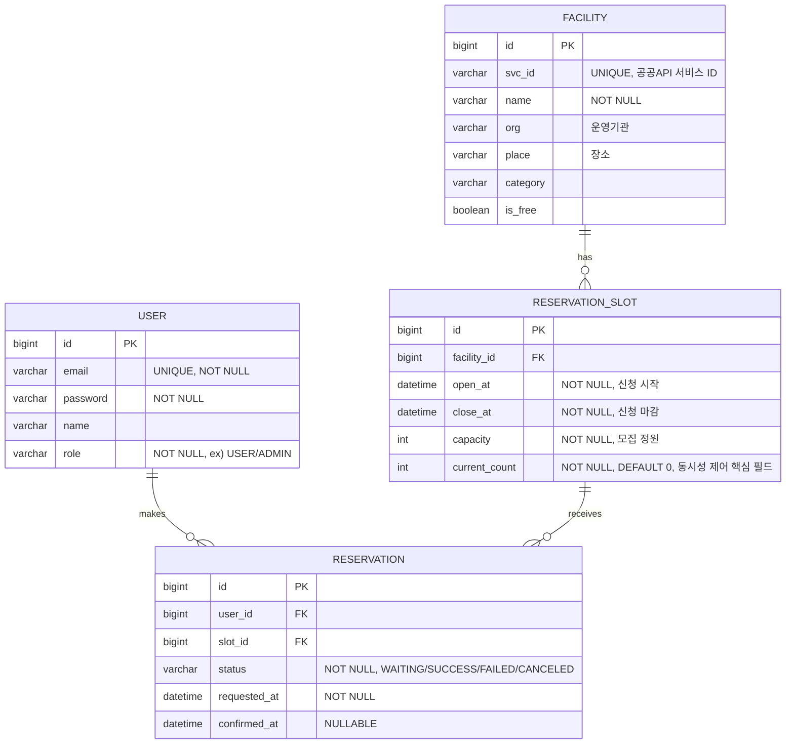

# GongGong (공공 예약 서비스)

서울시 공공서비스예약 데이터(체육시설/문화프로그램 등)를 기반으로 한 **선착순 예약 시스템**입니다. 개인 프로젝트로 한 학기(1학기) 동안 진행하며, 핵심 목표는 트래픽이 몰리는 상황에서의 **동시성 제어(분산락)** 와 **캐싱(Redis) 성능**을 실제로 구현하고 검증하는 것입니다.

> 본 문서는 구현 전 설계를 정리한 문서입니다. 각 결정에는 "왜 그렇게 설계했는지" 근거를 함께 남겨, 추후 발표자료 작성 시 그대로 참고할 수 있도록 작성했습니다.

---

## 목차

1. [프로젝트 소개 및 문제 정의](#1-프로젝트-소개-및-문제-정의)
2. [기술 스택](#2-기술-스택)
3. [디렉토리/패키지 구조](#3-디렉토리패키지-구조)
4. [ERD 설계](#4-erd-설계)
5. [API 명세](#5-api-명세)
6. [동시성 제어 구현 계획](#6-동시성-제어-구현-계획)
7. [캐싱 전략](#7-캐싱-전략)
8. [CORS 설정 안내](#8-cors-설정-안내)
9. [로컬 개발 환경 세팅 가이드](#9-로컬-개발-환경-세팅-가이드)
10. [구현 예정 (확장 예정 기능)](#10-구현-예정-확장-예정-기능)

---

## 1. 프로젝트 소개 및 문제 정의

### 왜 이 프로젝트인가

서울시가 공개하는 [공공서비스예약 데이터](https://data.seoul.go.kr)에는 체육시설 대관, 문화 프로그램 수강 신청 등 **모집 정원이 정해진 예약 자원**이 다수 포함되어 있습니다. 이런 서비스는 특정 오픈 시간에 신청이 몰리는 "오픈런" 트래픽 패턴을 보이는데, 실제 공공 예약 시스템에서도 아래와 같은 문제가 자주 발생합니다.

- **정합성 문제**: 동시에 여러 요청이 들어올 때 정원 체크와 예약 확정 사이에 race condition이 발생해 정원을 초과한 예약(오버부킹)이 발생함
- **성능 문제**: 오픈 직후 짧은 시간에 조회/예약 요청이 집중되어 DB에 부하가 몰리고 응답 지연이 커짐

이 프로젝트는 실제 공공 데이터를 사용해 위 상황을 재현하고, 다음 세 가지를 직접 구현하며 검증하는 것을 목표로 합니다.

1. 동시 요청 상황에서도 `현재 예약 인원(current_count)`이 `모집 정원(capacity)`을 절대 초과하지 않는 정합성 보장
2. 조회가 잦은 API에 캐싱을 적용해 DB 부하와 응답 시간을 개선
3. "비관적 락"과 "Redisson 분산락" 두 가지 동시성 제어 방식을 트래픽 테스트로 정량 비교하여, 각 방식의 장단점을 근거를 가지고 설명할 수 있도록 함

### 프로젝트 범위

- 백엔드(API 서버)만 구현하며, 프론트엔드는 별도 레포에서 개발됨을 전제로 함
- 데이터 원본은 서울시 공공서비스예약 Open API를 관리자 동기화(batch) 방식으로 내부 DB에 적재하여 사용

---

## 2. 기술 스택

| 구분 | 기술 | 비고 |
|---|---|---|
| Language | Java 17+ | Record, Sealed Class 등 최신 문법 활용 가능 |
| Framework | Spring Boot 3.x | |
| Data Access | Spring Data JPA | 비관적 락(1단계) 구현에 `@Lock` 활용 |
| Security | Spring Security + JWT | Stateless 인증, 프론트/백 분리 구조에 적합 |
| Database | MySQL 8.x | `SELECT ... FOR UPDATE` 비관적 락 지원 |
| Cache / Lock | Redis, Redisson | 캐싱(Look-aside) 및 분산락(2단계) 구현 |
| Build Tool | Gradle | |
| 부하 테스트 (예정) | nGrinder / K6 등 | 1단계 vs 2단계 성능·정합성 비교용, [구현 예정](#10-구현-예정-확장-예정-기능) 참고 |

---

## 3. 디렉토리/패키지 구조

도메인 중심(Domain-oriented) 패키지 구조를 채택합니다. 계층형(controller/service/repository를 최상위로 나누는 구조) 대신 도메인별로 나누는 이유는, 이 프로젝트의 핵심 로직(동시성 제어, 캐싱)이 `reservation`, `facility` 도메인에 집중되어 있어 관련 코드를 한 곳에서 관리하는 것이 락/캐시 정책을 일관되게 적용하고 추적하기 쉽기 때문입니다.

```
com.gonggong
├── common
│   ├── config          # SecurityConfig, RedisConfig, RedissonConfig, CorsConfig, SwaggerConfig 등
│   ├── exception        # 전역 예외 처리(@RestControllerAdvice), 커스텀 예외
│   ├── response         # 공통 API 응답 포맷(ApiResponse<T> 등)
│   └── lock              # 분산락 공용 어노테이션(@DistributedLock) + AOP (2단계에서 도입)
│
├── facility
│   ├── controller        # FacilityController
│   ├── service            # FacilityService, FacilitySyncService(공공API 연동/동기화)
│   ├── repository         # FacilityRepository
│   ├── domain              # Facility 엔티티
│   └── dto                  # FacilityResponse 등
│
├── reservation
│   ├── controller        # ReservationController, ReservationSlotController
│   ├── service             # ReservationService(동시성 제어 핵심), ReservationSlotService
│   ├── repository         # ReservationRepository, ReservationSlotRepository
│   ├── domain               # ReservationSlot, Reservation 엔티티, ReservationStatus(Enum)
│   └── dto                   # ReservationRequest/Response 등
│
├── user
│   ├── controller
│   ├── service               # UserService, AuthService(JWT 발급/검증)
│   ├── repository
│   ├── domain                 # User 엔티티, Role(Enum)
│   └── dto
│
└── GonggongApplication.java
```

**설계 원칙**
- 각 도메인 패키지는 `controller → service → repository` 방향으로만 의존하며, 도메인 간 참조는 서비스 계층에서만 허용(예: `ReservationService`가 `FacilityService`가 아닌 `ReservationSlotRepository`를 통해 필요한 정보만 조회)
- `common.lock`을 별도 패키지로 분리한 이유: 1단계(비관적 락)에서는 필요 없지만, 2단계에서 Redisson 분산락을 AOP 어노테이션(`@DistributedLock`)으로 공통화할 때 여러 도메인(향후 확장 시)에서 재사용할 수 있도록 미리 자리를 마련해 둠

---

## 4. ERD 설계



**설계 근거**

- `ReservationSlot.current_count`는 이 프로젝트에서 가장 중요한 필드입니다. `POST /api/reservations` 요청이 동시에 여러 건 들어와도 `current_count`가 `capacity`를 초과해 갱신되면 안 되며, 이 값을 안전하게 증가시키는 것이 [6. 동시성 제어 구현 계획](#6-동시성-제어-구현-계획)의 핵심 목표입니다.
- `Reservation.status`를 `WAITING/SUCCESS/FAILED/CANCELED`로 세분화한 이유: 락 획득 대기 중(WAITING), 락 획득 후 정원 초과로 실패(FAILED), 사용자가 취소한 경우(CANCELED)를 구분해서 기록해야 이후 트래픽 테스트에서 "몇 건이 실패했는지, 왜 실패했는지"를 분석할 수 있기 때문입니다.
- `Facility.svc_id`는 서울시 공공API의 원본 서비스 ID를 저장하는 컬럼으로, `/api/admin/sync` 실행 시 UPSERT(존재하면 갱신, 없으면 신규 삽입) 기준 키로 사용합니다.

---

## 5. API 명세

공통 응답 포맷:

```json
{
  "success": true,
  "data": { },
  "error": null
}
```

에러 발생 시:

```json
{
  "success": false,
  "data": null,
  "error": { "code": "SLOT_FULL", "message": "모집 정원이 마감되었습니다." }
}
```

| Method | Endpoint | 설명 |
|---|---|---|
| GET | `/api/facilities` | 시설/프로그램 목록 조회 (캐싱 대상) |
| GET | `/api/slots/{id}` | 예약 슬롯 상세 조회 (잔여 정원 포함) |
| POST | `/api/reservations` | 예약 신청 (동시성 제어 핵심 엔드포인트) |
| GET | `/api/reservations/{id}` | 예약 상세/상태 조회 |
| POST | `/api/admin/sync` | 서울시 공공API 데이터 동기화 (관리자 전용) |

### GET /api/facilities

- 설명: 등록된 시설/프로그램 목록을 조회합니다. 원본 데이터는 관리자 동기화를 통해서만 갱신되므로 변경 빈도가 낮아 캐싱 대상입니다.

Response 예시:
```json
{
  "success": true,
  "data": [
    {
      "id": 1,
      "svcId": "S2025-001234",
      "name": "OO체육센터 실내수영장",
      "org": "OO구청",
      "place": "OO체육센터",
      "category": "체육시설",
      "isFree": false
    }
  ],
  "error": null
}
```

### GET /api/slots/{id}

- 설명: 특정 예약 슬롯의 상세 정보(신청 기간, 정원, 잔여 인원)를 조회합니다.

Response 예시:
```json
{
  "success": true,
  "data": {
    "id": 10,
    "facilityId": 1,
    "openAt": "2026-03-02T10:00:00",
    "closeAt": "2026-03-02T10:10:00",
    "capacity": 20,
    "currentCount": 17
  },
  "error": null
}
```

### POST /api/reservations

- 설명: 로그인한 사용자가 특정 슬롯에 예약을 신청합니다. 정원이 남아있는 경우에만 `SUCCESS`로 확정되며, 이 과정에서 동시성 제어가 적용됩니다.

Request 예시:
```json
{
  "slotId": 10
}
```

Response 예시 (성공):
```json
{
  "success": true,
  "data": {
    "reservationId": 501,
    "status": "SUCCESS"
  },
  "error": null
}
```

Response 예시 (정원 마감):
```json
{
  "success": false,
  "data": null,
  "error": { "code": "SLOT_FULL", "message": "모집 정원이 마감되었습니다." }
}
```

### GET /api/reservations/{id}

- 설명: 예약 건의 현재 상태(WAITING/SUCCESS/FAILED/CANCELED)와 상세 정보를 조회합니다.

Response 예시:
```json
{
  "success": true,
  "data": {
    "reservationId": 501,
    "slotId": 10,
    "status": "SUCCESS",
    "requestedAt": "2026-03-02T10:00:01.234",
    "confirmedAt": "2026-03-02T10:00:01.456"
  },
  "error": null
}
```

### POST /api/admin/sync

- 설명: 서울시 공공서비스예약 Open API를 호출하여 `Facility`, `ReservationSlot` 데이터를 동기화합니다. 관리자(Role=ADMIN)만 호출 가능하며, 실행 시 관련 캐시를 무효화합니다.

Response 예시:
```json
{
  "success": true,
  "data": { "syncedFacilities": 42, "syncedSlots": 128 },
  "error": null
}
```

---

## 6. 동시성 제어 구현 계획

동시성 제어는 이 프로젝트의 핵심 검증 대상이므로, 한 번에 최종 구현을 적용하지 않고 **1단계(비관적 락) → 2단계(Redisson 분산락)** 순서로 단계를 나누어 구현합니다. 이렇게 나누는 이유는 (1) 먼저 가장 단순한 방식으로 정합성을 보장하는 baseline을 만들고, (2) 이후 분산락으로 전환했을 때의 성능/구조적 차이를 실측 비교할 수 있도록 하기 위함입니다.

### 1단계: 비관적 락 (`SELECT ... FOR UPDATE`)

- **적용 대상**: `reservation.service.ReservationService.reserve(userId, slotId)`
  - `ReservationSlotRepository`에 `@Lock(LockModeType.PESSIMISTIC_WRITE)`를 적용한 `findByIdForUpdate(Long slotId)` 메서드를 정의하고, `reserve()` 내에서 이 메서드로 슬롯을 조회
  - 하나의 트랜잭션 안에서 "잔여 정원 확인 → `current_count` 증가 → `Reservation` 저장"을 순차 수행
- **설계 근거**
  - 초기 단계에서는 단일 애플리케이션 인스턴스, 단일 DB 트랜잭션 환경을 가정합니다. 이 조건에서는 DB의 row-level 락만으로도 동시 요청 간 `current_count` 갱신 순서를 보장할 수 있어, 별도의 외부 인프라(Redis) 없이 **가장 단순하고 구현 리스크가 적은 방법으로 정합성을 먼저 확보**하는 것이 우선순위입니다.
  - 이 baseline이 있어야 2단계 도입 후 "성능이 실제로 개선되었는지"를 비교할 기준선을 가질 수 있습니다.
- **알려진 한계 (2단계 도입 이유)**
  - 락을 획득한 트랜잭션이 끝날 때까지 다른 요청은 DB 커넥션을 점유한 채 대기하므로, 동시 요청이 많아질수록 커넥션 풀이 고갈되어 전체 처리량이 급격히 떨어질 수 있습니다.
  - 애플리케이션을 다중 인스턴스로 확장(scale-out)해도 동기화 지점이 여전히 단일 DB이므로, 애플리케이션 서버를 늘리는 것만으로는 처리량이 늘지 않습니다.

### 2단계: Redisson 분산락

- **적용 대상**: 동일한 `ReservationService.reserve()` 메서드
  - `common.lock.@DistributedLock` 어노테이션 + AOP(`DistributedLockAspect`)를 도입하여, `RedissonClient.getLock("reservation:slot:{slotId}")` 형태의 키로 락을 획득/해제하는 로직을 공통화
  - 락 획득 성공 후에는 짧은 DB 트랜잭션으로 "정원 확인 → `current_count` 증가 → `Reservation` 저장"만 수행하고 즉시 락을 해제하여 락 점유 시간을 최소화
  - 1단계의 `PESSIMISTIC_WRITE` 락은 제거하고, 대신 일반 조회(`findById`)로 슬롯을 조회
- **설계 근거**
  - 동기화 지점을 "DB 트랜잭션 락"에서 "Redis 키 단위 락"으로 옮기면, DB 커넥션을 점유하지 않고도 요청 순서를 보장할 수 있어 애플리케이션 서버를 다중 인스턴스로 확장했을 때도 동일한 정합성 보장이 가능해집니다.
  - Redisson을 선택한 이유는, 순수 `Jedis`/`Lettuce`로 직접 분산락을 구현할 경우 락 획득 재시도를 spin-lock(반복 polling) 방식으로 처리해야 해 Redis에 불필요한 부하가 발생하는데, Redisson은 pub/sub 기반 대기 방식(`Lock` 해제 시 대기 중인 클라이언트에 알림)을 제공하여 같은 목적을 더 낮은 Redis 부하로 달성할 수 있기 때문입니다.
  - `@DistributedLock` 어노테이션 + AOP로 공통화하는 이유는, 락 획득/해제/예외 처리 로직이 비즈니스 로직과 섞이면 실수로 락 해제를 빠뜨리는 등의 버그가 발생하기 쉬우므로, 횡단 관심사(cross-cutting concern)로 분리해 안전하게 재사용하기 위함입니다.

### 비교 검증 계획

- 1단계와 2단계 각각에 대해 동일한 시나리오(예: 정원 20명 슬롯에 200명 동시 요청)로 부하 테스트를 수행하여 다음을 비교합니다.
  - 오버부킹 발생 여부(정합성): 두 방식 모두 0건이어야 함
  - TPS(처리량) 및 P99 응답 시간
  - DB 커넥션 풀 사용률
- 구체적인 부하 테스트 도구/시나리오는 [10. 구현 예정](#10-구현-예정-확장-예정-기능)에서 별도로 다룹니다.

---

## 7. 캐싱 전략

Look-aside(Cache-Aside) 패턴을 적용합니다. 애플리케이션이 캐시를 먼저 조회하고, 없으면 DB를 조회해 캐시에 채워 넣는 방식으로, Spring의 `@Cacheable`/`@CacheEvict`와 Redis를 조합해 구현합니다.

| 대상 | 캐싱 여부 | TTL(제안) | 근거 |
|---|---|---|---|
| `GET /api/facilities` (시설 목록) | O | 10분 | 원본 데이터가 관리자 동기화(`/api/admin/sync`)로만 갱신되어 변경 빈도가 매우 낮음. 긴 TTL로 캐시 적중률을 높여도 데이터 신선도 문제가 거의 없음 |
| `GET /api/slots/{id}`의 정적 정보(`openAt`, `closeAt`, `capacity` 등) | O | 5분 | 슬롯 생성 후 거의 변경되지 않는 값. 목록보다 조회 빈도가 높고 개별 자원이라 TTL을 조금 더 짧게 잡아 데이터 오차 범위를 줄임 |
| `ReservationSlot.currentCount` (잔여 정원) | X (캐시 제외) | - | 예약 신청 시점마다 실시간으로 바뀌는 값이며, 캐시된 값을 기준으로 정원 판단을 하면 실제 DB 값과 어긋나 오버부킹으로 이어질 수 있음. 따라서 이 필드는 항상 DB(1단계) 또는 락 보호 하의 최신 값(2단계)에서 직접 조회 |

**캐시 무효화 전략**
- `POST /api/admin/sync` 실행 완료 시, 갱신된 `Facility`/`ReservationSlot`과 관련된 캐시 키를 `@CacheEvict`로 명시적으로 삭제합니다. 동기화는 빈도가 낮고 명확한 트리거가 있는 이벤트이므로, TTL 만료를 기다리지 않고 즉시 무효화하는 것이 데이터 정합성 측면에서 더 안전합니다.
- 캐시 조회 API와 정원 판단 로직을 완전히 분리한 이유는, "조회 성능"과 "예약 정합성"이라는 두 목표가 충돌하지 않도록 하기 위함입니다. 캐싱은 조회 API(`GET`)에만 적용하고, 쓰기가 발생하는 예약 로직(`POST /api/reservations`)에는 캐시를 개입시키지 않습니다.

---

## 8. CORS 설정 안내

프론트엔드는 별도 저장소/포트(예: `http://localhost:3000` 또는 별도 배포 도메인)에서 동작할 예정이므로, Spring Security 설정에서 CORS를 명시적으로 허용해야 합니다.

구현 시 결정해야 할 항목 체크리스트:

- [ ] **허용 Origin**: 로컬 개발용(`http://localhost:3000` 등)과 배포 시 실제 프론트 도메인을 구분해서 관리(가급적 `*` 와일드카드 대신 명시적 목록 사용)
- [ ] **허용 Method**: `GET, POST, PUT, DELETE, OPTIONS` 등 실제 사용하는 메서드만 허용
- [ ] **허용 Header**: `Authorization`, `Content-Type` 등 프론트에서 실제로 보내는 헤더 확인
- [ ] **Credentials 허용 여부**: JWT를 쿠키가 아닌 `Authorization` 헤더로 전달할 경우 `allowCredentials`는 불필요할 수 있음. 인증 방식(헤더 vs 쿠키)이 확정되면 함께 결정
- [ ] **적용 범위**: `WebMvcConfigurer.addCorsMappings()`로 전역 설정할지, `SecurityFilterChain`의 `cors()` 설정으로 Security 레벨에서 처리할지 결정 (JWT 인증 필터와 함께 동작해야 하므로 Security 설정 쪽을 권장)

실제 Origin 값 등은 프론트엔드 배포 환경이 확정된 후 채워 넣습니다.

---

## 9. 로컬 개발 환경 세팅 가이드

로컬 실행을 위해서는 MySQL과 Redis가 (로컬 설치 또는 Docker로) 실행 중이어야 합니다. `application.yml`(또는 `application-local.yml`)에 아래 항목들을 설정합니다. 실제 값은 비밀번호/키 등이 포함되므로 이 문서에는 채워야 할 항목만 정리하고, 실제 값은 `.gitignore` 처리된 로컬 설정 파일 또는 환경변수로 관리합니다.

| 설정 키 | 설명 |
|---|---|
| `spring.datasource.url` | MySQL 접속 URL (예: `jdbc:mysql://localhost:3306/gonggong`) |
| `spring.datasource.username` / `password` | MySQL 계정 정보 |
| `spring.datasource.driver-class-name` | `com.mysql.cj.jdbc.Driver` |
| `spring.jpa.hibernate.ddl-auto` | 로컬 개발 초기엔 `update` 또는 `create` 권장, 이후 스키마가 안정되면 `validate`로 전환하고 마이그레이션 도구 사용 검토 |
| `spring.jpa.show-sql` / `properties.hibernate.format_sql` | 로컬에서는 `true`로 두고 실제 실행되는 쿼리(특히 락이 걸리는 쿼리) 확인 |
| `spring.data.redis.host` / `port` | 로컬 Redis 접속 정보 (기본 `localhost:6379`) |
| Redisson 설정 (`RedissonConfig`) | `redisson-spring-boot-starter` 사용 시 위 Redis host/port를 그대로 활용하거나, `RedissonClient` Bean을 직접 등록해 `redis://host:port` 형태로 지정 |
| `jwt.secret` | JWT 서명에 사용할 비밀 키. 환경변수로 주입하고 저장소에 커밋하지 않음 |
| `jwt.expiration` | Access/Refresh 토큰 만료 시간 |
| `openapi.seoul.key` (외부 API) | 서울시 공공데이터 Open API 인증키. `/api/admin/sync`에서 사용, 환경변수로 관리 |

**실행 전제조건**
- 로컬 MySQL 인스턴스(또는 Docker 컨테이너)에 위 DB가 생성되어 있어야 함
- 로컬 Redis 인스턴스(또는 Docker 컨테이너)가 기본 포트로 실행 중이어야 함
- 민감한 값(DB 비밀번호, JWT secret, 공공API 키)은 `application-local.yml` 또는 `.env`로 분리하고 `.gitignore`에 등록하여 저장소에 커밋되지 않도록 함

---

## 10. 구현 예정 (확장 예정 기능)

아래 항목들은 이번 학기 핵심 목표(동시성 제어 + 캐싱 검증) 이후, 시간이 허락하는 범위에서 추가로 검증해보고 싶은 확장 기능입니다.

- **메시지 큐(Kafka/RabbitMQ) 도입**: 현재는 예약 요청을 동기적으로 처리(락 획득 → DB 반영)하지만, 요청을 큐에 우선 적재하고 별도 컨슈머가 순차 처리하는 구조로 확장하면 DB에 도달하는 요청 자체를 줄여 더 높은 트래픽에도 안정적으로 대응할 수 있는지 검증
- **WebSocket**: 예약 슬롯의 잔여 정원 변경이나 대기열 상태를 클라이언트에 실시간으로 push하여, 폴링 없이도 최신 상태를 보여주는 구조 검증
- **부하 테스트 자동화 및 결과 기록**: nGrinder 또는 K6 등을 이용해 [6. 동시성 제어 구현 계획](#6-동시성-제어-구현-계획)에서 정의한 1단계 vs 2단계 비교 시나리오를 자동화하고, TPS/응답시간/오버부킹 여부를 정리하여 발표자료용 데이터로 축적
